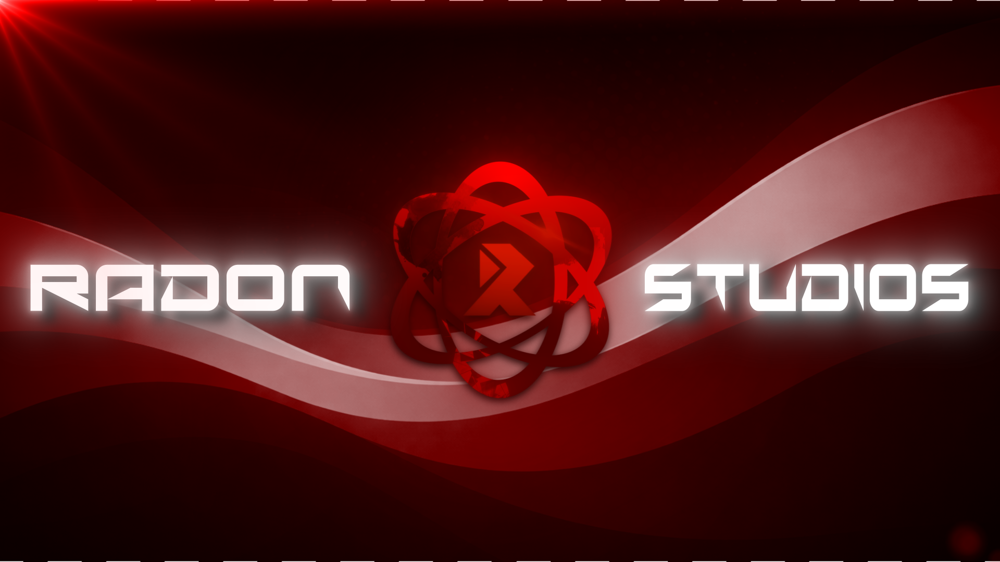

  

# Radon Studios

> Building custom software, automation tools, and Discord bots.

---

## What We Do

Radon Studios builds practical software for creators, communities, and businesses.
Sometimes that means a fast Discord bot for a growing server.
Other times it's a full custom system or application built from the ground up.

We like solving problems with code and shipping tools people actually use.

---

## So what do we build?

* Discord bots and community tooling
* Custom software and applications
* Automation systems and integrations
* Developer tools and utilities
* Backend services and APIs

---

## Our Style

Software should be simple, reliable, and built to last.

We focus on:

* clean architecture
* practical solutions
* performance where it matters
* tools people can depend on

No overengineering. No fluff.

Just solid software.

---

## Projects

This organization hosts projects developed by Radon Studios.

Some are internal tools.
Some are open source.
Some are experiments that turned into real products.

Feel free to explore the repos.

---

## Work With Us

Need custom software, a Discord bot, or automation for your project?

Reach out and tell us what you're trying to build at:

info@radonstudios.com
